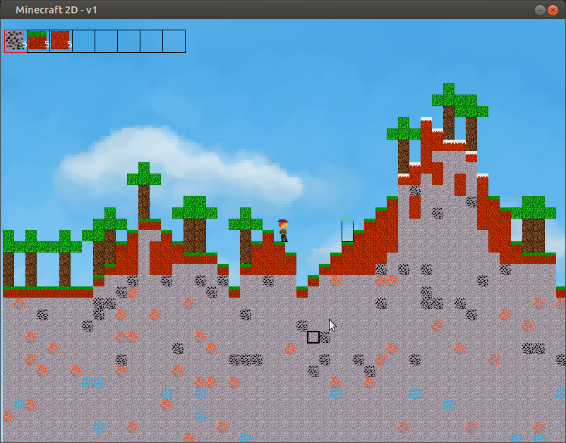

# minecraft-2D-clone
An attempt to make a clone of Minecraft in 2d. School project. Made by ~6 peoples.
I especially worked on collisions, save system, game physics and infinite world generation.
None game making libs were used

